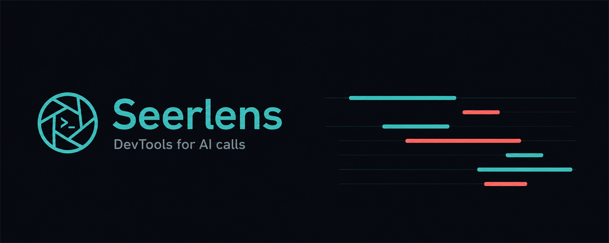
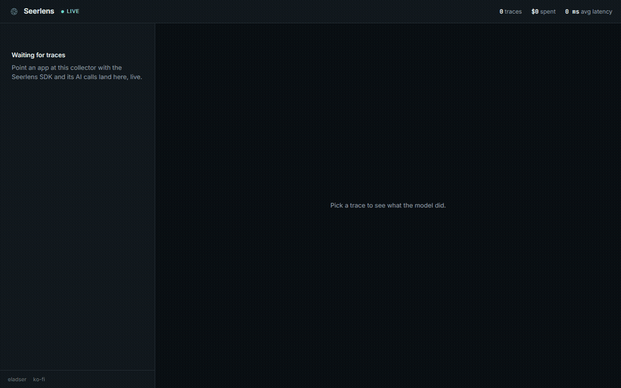
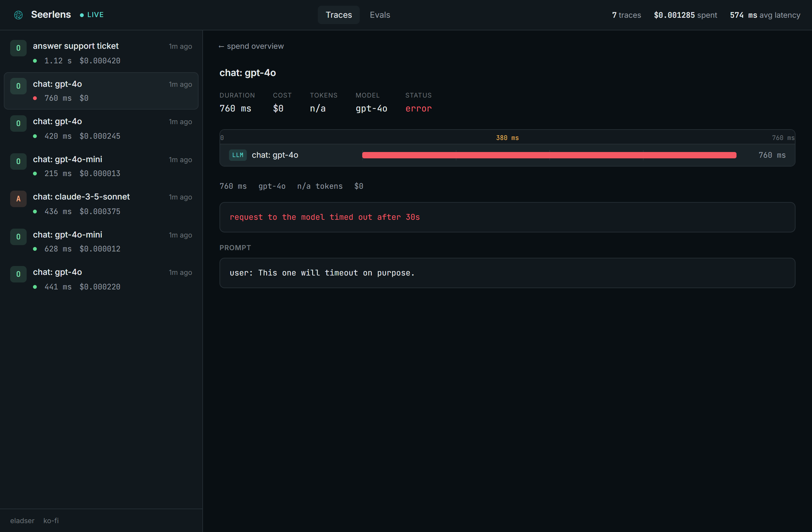

<p align="center">
  
</p>

<p align="center">
  <a href="https://www.nuget.org/packages/Seerlens"></a>
  <a href="https://www.nuget.org/packages/Seerlens.Sdk"></a>
  <a href="https://github.com/eladser/seerlens/actions/workflows/ci.yml"></a>
</p>

DevTools for AI calls. One line of setup and a local dashboard shows every LLM call your app makes: the prompt, what it cost, how many tokens, how long it took, and which tools it called. Runs on your machine. No signup.

Think of it as the browser Network tab, pointed at your AI calls.



## The problem

When you build something on top of an LLM you mostly fly blind. You send a prompt, you get an answer, and the interesting parts are invisible: the exact text that went to the model after your code stitched it together, the dollar cost of that one call, whether the agent called a tool and how long it took, and whether a prompt or model swap quietly made things worse.

The tools that answer this (Langfuse, Arize Phoenix, Helicone) are platforms you deploy. Seerlens is the opposite: a single command you run locally while you build.

## What you get

- **Live trace feed.** Calls show up the moment they happen.
- **A timeline per trace.** LLM calls and tool calls laid out on a real time ruler, so you can see what ran when and what was slow.
- **Cost, tokens, latency** per call and per trace, priced across the common OpenAI, Anthropic, and Google models.
- **The actual prompt and completion**, not a summary.
- **Failures, captured.** A call that throws is recorded with its error, so you can see what broke.
- **Eval trends.** Score a golden set against your prompts and watch the number over time, so a model swap that drops quality shows up as a line heading down, not a surprise in production.



## Quick start

Install the collector and run it:

```bash
dotnet tool install -g Seerlens
seerlens
```

That serves the dashboard at http://localhost:5005.

Then point your app at it. In .NET, wrap the `IChatClient` you already use:

```csharp
using Seerlens.Sdk;

SeerlensTrace.Configure("http://localhost:5005");

IChatClient client = baseClient.UseSeerlens();
```

That's it. Every call through `client` shows up in the dashboard. To group a multi-step interaction (a couple of model calls with a tool lookup between them) into a single trace:

```csharp
using (SeerlensTrace.Begin("answer support ticket"))
{
    await client.GetResponseAsync(messages);
    using (SeerlensTrace.Tool("lookupOrder"))
        order = await orders.Find(id);
    await client.GetResponseAsync(followup);
}
```

The SDK ships traces on a background queue. If the collector is down or busy, traces are dropped and your app keeps running. Instrumentation never blocks or throws into your code.

### Other ways to run it

- **Docker:** `docker build -t seerlens . && docker run -p 5005:5005 seerlens`
- **No .NET installed?** Grab a self-contained build (`seerlens-win-x64.zip`, `linux-x64`, `osx-arm64`) from the [releases](https://github.com/eladser/seerlens/releases) and run the `seerlens` binary inside.
- **SDK on NuGet:** `dotnet add package Seerlens.Sdk`.

### From other languages

The collector speaks OTLP. Point any OpenTelemetry exporter at `http://localhost:5005/v1/traces` and spans that follow the GenAI conventions (Python via OpenLLMetry, JS, and so on) show up the same as the .NET ones, no Seerlens SDK needed.

## How it works

The collector takes traces, stores them in a local SQLite file, and pushes new ones to the dashboard over server-sent events. It accepts both a small JSON contract (what the .NET SDK posts) and raw OpenTelemetry traces at `/v1/traces`, normalizing GenAI spans from either into one model. The dashboard is a small React app the collector serves itself.

```
your app ──► Seerlens SDK ──► collector ──► SQLite
                                  │
                                  └──► live feed (SSE) ──► dashboard
```

| Piece | What it is |
|-------|-----------|
| `Seerlens.Sdk` | .NET SDK. An `IChatClient` wrapper plus a small API for grouping traces. |
| `Seerlens.Evals` | Golden sets, scorers (keyword or LLM-as-judge), and a runner that scores your prompts and reports the run. |
| `Seerlens.Collector` | ASP.NET Core app. Trace and eval ingest, SQLite store, live feed, and it serves the dashboard. Packaged as the `seerlens` tool. |
| `dashboard` | React + TypeScript UI. Trace timeline, cost and token rollups, and the eval trend. |

## Run it from source

```bash
# build the dashboard into the collector
cd dashboard && npm install && npm run build && cd ..

# run the collector
dotnet run --project src/Seerlens.Collector

# in another shell, send some sample traces
dotnet run --project samples/ChatSample
```

The sample uses a fake model client, so it runs without any API keys.

## Tests

```bash
dotnet test
```

Covers the store and pricing, the ingest endpoint, and the SDK's safety contract (it records on success, rethrows real errors, and a broken collector can't break the host app).

## Status and what's next

Live tracing for .NET, OTLP ingest for everything else, and eval trends. On the list:

- **LLM-as-judge by default.** The eval engine already supports a model judge for faithfulness and relevancy; next is wiring it through the dashboard so you can pick the scorer per set.
- **Python and JavaScript SDKs.** A thin one-line wrapper like the .NET one, for apps that don't already run OpenTelemetry.
- **Streaming.** Token-by-token responses pass through but aren't yet recorded as their own spans.

## Made by

Elad Sertshuk, a full-stack engineer who builds developer tools.

- GitHub: [@eladser](https://github.com/eladser)
- LinkedIn: [elad-sertshuk](https://www.linkedin.com/in/elad-sertshuk)
- Site: [eladser.dev](https://eladser.dev)

If Seerlens saved you some time, you can [buy me a coffee](https://ko-fi.com/eladser).

## License

MIT
